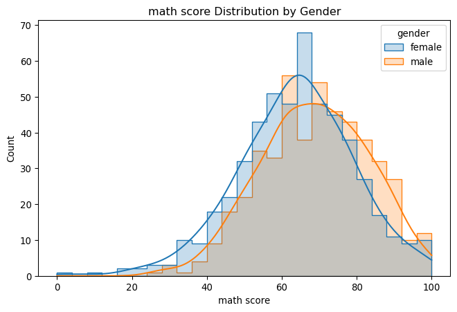
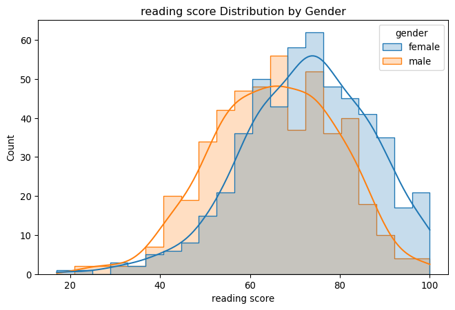
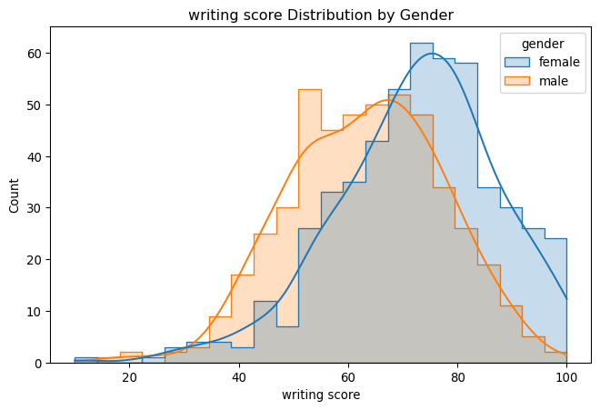
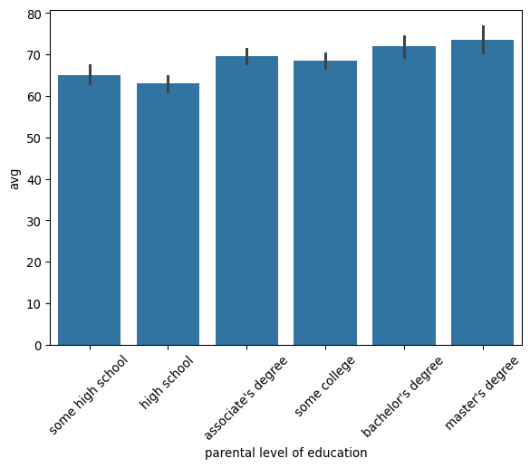

# Final Presentation

### Introduction
In this project, I analyzed several factors that influence students’ academic performance using
both visualizations and a regression model. My goal was to explore how characteristics may
relate to students’ overall average scores.

### Read

``` python
import pandas as pd
import statsmodels.api as sm
import seaborn as sns
import pandas as pd

performance=pd.read_csv('~/Desktop/Master/Module 2/Data Wrangling/Final Presentation/StudentsPerformance.csv')

performance.head()
performance.dtypes
```

    gender                         object
    race/ethnicity                 object
    parental level of education    object
    lunch                          object
    test preparation course        object
    math score                      int64
    reading score                   int64
    writing score                   int64
    dtype: object

### Clean Data

``` python
df = performance.copy()

df.columns = df.columns.str.strip().str.lower()

df['test_prep'] = df['test preparation course'].map({'completed': 1, 'none': 0})

df["avg"] = df[["math score","reading score","writing score"]].mean(axis=1)

df.head()
```

|  | gender | race/ethnicity | parental level of education | lunch | test preparation course | math score | reading score | writing score | test_prep | avg |
|----|----|----|----|----|----|----|----|----|----|----|
| 0 | female | group B | bachelor's degree | standard | none | 72 | 72 | 74 | 0 | 72.666667 |
| 1 | female | group C | some college | standard | completed | 69 | 90 | 88 | 1 | 82.333333 |
| 2 | female | group B | master's degree | standard | none | 90 | 95 | 93 | 0 | 92.666667 |
| 3 | male | group A | associate's degree | free/reduced | none | 47 | 57 | 44 | 0 | 49.333333 |
| 4 | male | group C | some college | standard | none | 76 | 78 | 75 | 0 | 76.333333 |


### Visualize

1.  Is the Test Preparation Course Effective compared to overall average
    socre.

``` python
sns.boxplot(data=df, x="test_prep", y="avg")
```


The result shows that doing test preparation has effectively affect the
overall test score, indicating it is nesscessary to prepare for the
exam.

2.  Explore the relationship between gender and each subject’s test
    score.

``` python
import seaborn as sns
import matplotlib.pyplot as plt

scores = ["math score", "reading score", "writing score"]

for col in scores:
    plt.figure(figsize=(8,5))
    sns.histplot(data=df, x=col, hue="gender", kde=True, element="step")
    plt.title(f"{col} Distribution by Gender")
    plt.show()
```







Across all three subjects, males tend to perform slightly stronger in
math, while females consistently outperform males in reading and
writing, showing a clear gender-based performance pattern aligned with
common academic trends. Males score slightly higher in math, with a more
concentrated distribution in the 60–90 range.Females outperform males
significantly in reading, with higher concentration in the 70–100 range.
Females show a strong advantage in writing, with a higher and more
right-shifted score distribution.

3.  Explore the relationship between parental level of education and
    students’ overall average score.

``` python
import numpy as np
order = ["some high school","high school","associate's degree","some college","bachelor's degree","master's degree"
]

df["parental level of education"] = pd.Categorical(
    df["parental level of education"],
    categories=order,
    ordered=True
)

sns.barplot(
    data=df,
    x="parental level of education",
    y="avg",
    estimator=np.mean,
    order=order  
)

plt.xticks(rotation=45)
plt.show()
```



Students with more highly educated parents tend to achieve higher
average scores. Performance rises consistently from “some high school”
to “master’s degree,” showing a clear positive relationship between
parental education and student achievement.

### Feature Engineering

``` python
df['is_female'] = df['gender'].map({'female': 1, 'male': 0})

df['lunch_bin'] = df['lunch'].map({'standard': 1, 'free/reduced': 0})

if 'race/ethnicity' in df.columns:
    df = pd.get_dummies(df, columns=['race/ethnicity'], drop_first=True, dtype=int)

if 'parental level of education' in df.columns:
    df = pd.get_dummies(df, columns=['parental level of education'], drop_first=True, dtype=int)

bool_cols = df.select_dtypes(include=['bool']).columns
df[bool_cols] = df[bool_cols].astype(int)

df.head()
```

<div>
<style scoped>
    .dataframe tbody tr th:only-of-type {
        vertical-align: middle;
    }
&#10;    .dataframe tbody tr th {
        vertical-align: top;
    }
&#10;    .dataframe thead th {
        text-align: right;
    }
</style>

|  | gender | lunch | test preparation course | math score | reading score | writing score | test_prep | avg | is_female | lunch_bin | race/ethnicity_group B | race/ethnicity_group C | race/ethnicity_group D | race/ethnicity_group E | parental level of education_high school | parental level of education_associate's degree | parental level of education_some college | parental level of education_bachelor's degree | parental level of education_master's degree |
|----|----|----|----|----|----|----|----|----|----|----|----|----|----|----|----|----|----|----|----|
| 0 | female | standard | none | 72 | 72 | 74 | 0 | 72.666667 | 1 | 1 | 1 | 0 | 0 | 0 | 0 | 0 | 0 | 1 | 0 |
| 1 | female | standard | completed | 69 | 90 | 88 | 1 | 82.333333 | 1 | 1 | 0 | 1 | 0 | 0 | 0 | 0 | 1 | 0 | 0 |
| 2 | female | standard | none | 90 | 95 | 93 | 0 | 92.666667 | 1 | 1 | 1 | 0 | 0 | 0 | 0 | 0 | 0 | 0 | 1 |
| 3 | male | free/reduced | none | 47 | 57 | 44 | 0 | 49.333333 | 0 | 0 | 0 | 0 | 0 | 0 | 0 | 1 | 0 | 0 | 0 |
| 4 | male | standard | none | 76 | 78 | 75 | 0 | 76.333333 | 0 | 1 | 0 | 1 | 0 | 0 | 0 | 0 | 1 | 0 | 0 |

</div>

### Model

Create any type of model to answer a question of your choice.

Question to answer: Which factors most significantly affect students’
overall academic performance?

``` python
from sklearn.linear_model import LinearRegression
import statsmodels.formula.api as smf

df = df.rename(columns=lambda x: x.replace("'", "").replace("/", "_").replace(" ", "_"))

X = df.drop(["math_score","reading_score","writing_score","avg","gender","lunch","test_preparation_course"], axis=1)

features = X.columns
formula = "avg ~ " + " + ".join(features)

model = smf.ols(formula=formula, data=df).fit()
model.summary()
```

|                   |                  |                     |          |
|-------------------|------------------|---------------------|----------|
| Dep. Variable:    | avg              | R-squared:          | 0.242    |
| Model:            | OLS              | Adj. R-squared:     | 0.233    |
| Method:           | Least Squares    | F-statistic:        | 26.30    |
| Date:             | Tue, 02 Dec 2025 | Prob (F-statistic): | 7.55e-52 |
| Time:             | 16:09:43         | Log-Likelihood:     | -3937.0  |
| No. Observations: | 1000             | AIC:                | 7900\.   |
| Df Residuals:     | 987              | BIC:                | 7964\.   |
| Df Model:         | 12               |                     |          |
| Covariance Type:  | nonrobust        |                     |          |

OLS Regression Results

|  |  |  |  |  |  |  |
|----|----|----|----|----|----|----|
|  | coef | std err | t | P\>\|t\| | \[0.025 | 0.975\] |
| Intercept | 51.0380 | 1.680 | 30.374 | 0.000 | 47.741 | 54.335 |
| test_prep | 7.6386 | 0.830 | 9.201 | 0.000 | 6.009 | 9.268 |
| is_female | 3.7242 | 0.795 | 4.682 | 0.000 | 2.163 | 5.285 |
| lunch_bin | 8.7751 | 0.827 | 10.605 | 0.000 | 7.151 | 10.399 |
| race_ethnicity_group_B | 1.5290 | 1.612 | 0.949 | 0.343 | -1.634 | 4.691 |
| race_ethnicity_group_C | 2.3855 | 1.509 | 1.581 | 0.114 | -0.576 | 5.347 |
| race_ethnicity_group_D | 5.1258 | 1.540 | 3.329 | 0.001 | 2.104 | 8.147 |
| race_ethnicity_group_E | 6.9285 | 1.708 | 4.056 | 0.000 | 3.577 | 10.280 |
| parental_level_of_education_high_school | -0.6325 | 1.300 | -0.486 | 0.627 | -3.184 | 1.919 |
| parental_level_of_education_associates_degree | 4.5400 | 1.264 | 3.592 | 0.000 | 2.060 | 7.020 |
| parental_level_of_education_some_college | 3.6124 | 1.256 | 2.875 | 0.004 | 1.147 | 6.078 |
| parental_level_of_education_bachelors_degree | 7.0756 | 1.485 | 4.765 | 0.000 | 4.162 | 9.989 |
| parental_level_of_education_masters_degree | 8.6322 | 1.887 | 4.574 | 0.000 | 4.929 | 12.335 |

|                |        |                   |         |
|----------------|--------|-------------------|---------|
| Omnibus:       | 12.572 | Durbin-Watson:    | 2.043   |
| Prob(Omnibus): | 0.002  | Jarque-Bera (JB): | 12.915  |
| Skew:          | -0.274 | Prob(JB):         | 0.00157 |
| Kurtosis:      | 2.897  | Cond. No.         | 11.8    |

<br/><br/>Notes:<br/>[1] Standard Errors assume that the covariance matrix of the errors is correctly specified.

Students’ socioeconomic resources and academic support systems strongly
influence their overall academic performance. Among all factors, lunch
status has the largest effect, with students receiving standard lunch
scoring about 8.8 points higher than those on free or reduced lunch.
This most likely speaks to broader socioeconomic advantages: students
with standard lunch may come from households with greater financial
stability, better nutrition, and more consistent learning environments,
which all support academic success.

Another critical aspect is test preparation; on average, the performance
for students who completed their test prep stood at approximately 7.6
points higher. It could follow, then, that structured academic support,
access to study materials, and guided practice meaningfully improve
performance across subjects.

Parental education level indicates a clear upward gradient: students
whose parents hold a master’s degree perform about 8.6 points higher,
and bachelor’s degree parents add 7.0 points. Generally speaking, the
higher the parental education, the higher the academic encouragement,
familiarity with school expectations, and access to educational
resources at home.

The influence of gender is smaller but still meaningful, with girls
outperforming boys by about 3.7 points, as in the widely observed trends
in both reading and writing achievement. Together, these findings
highlight the fact that socioeconomic background (lunch status, parental
education) and academic support (test preparation) significantly shape
student performance while demographic factors such as gender add further
variation.
